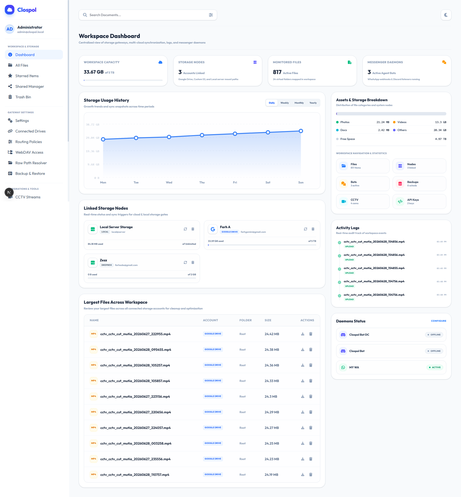
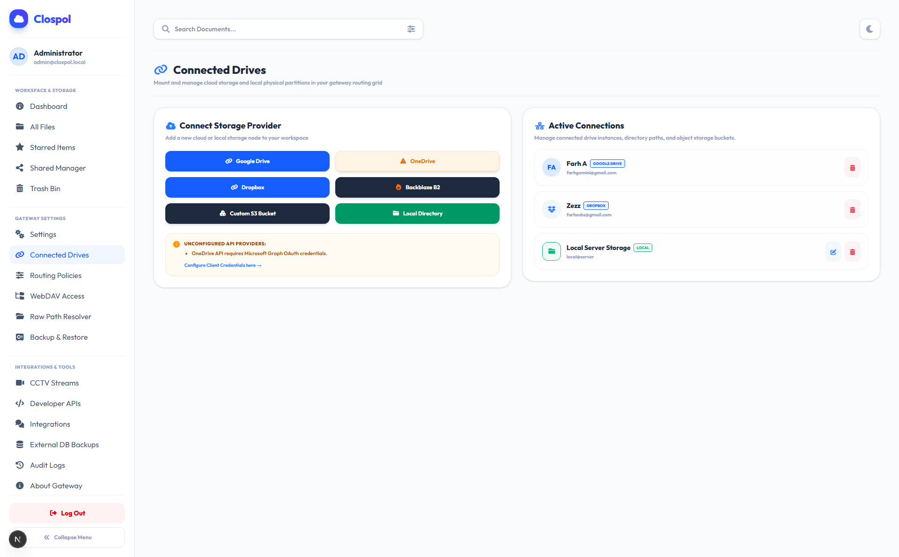
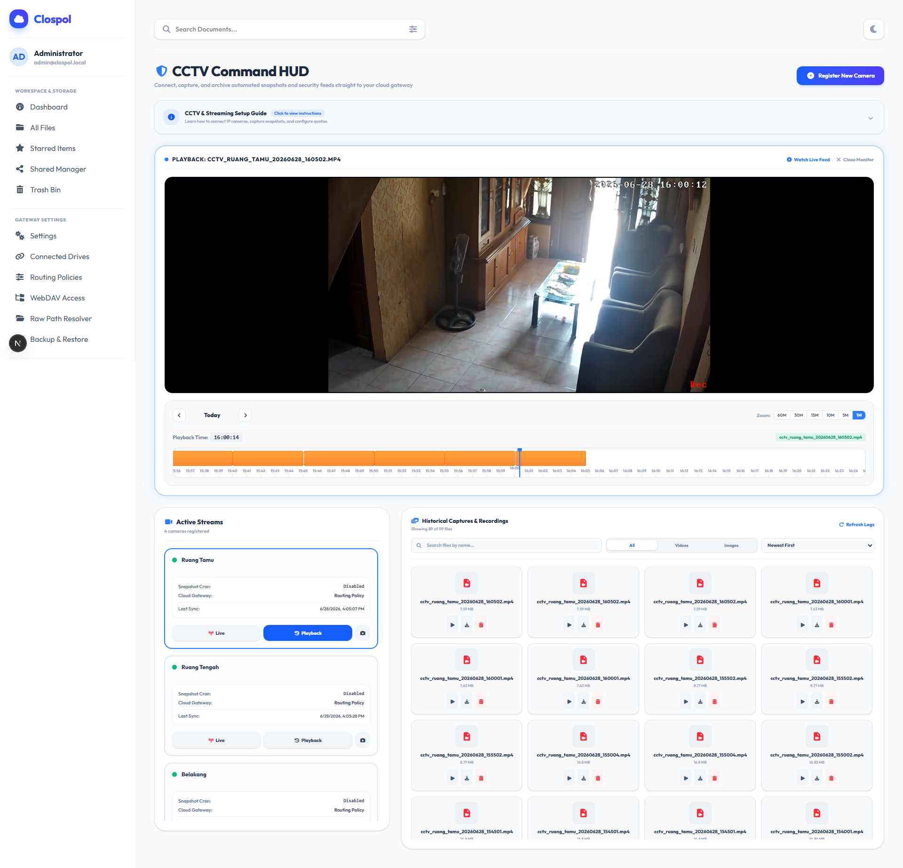
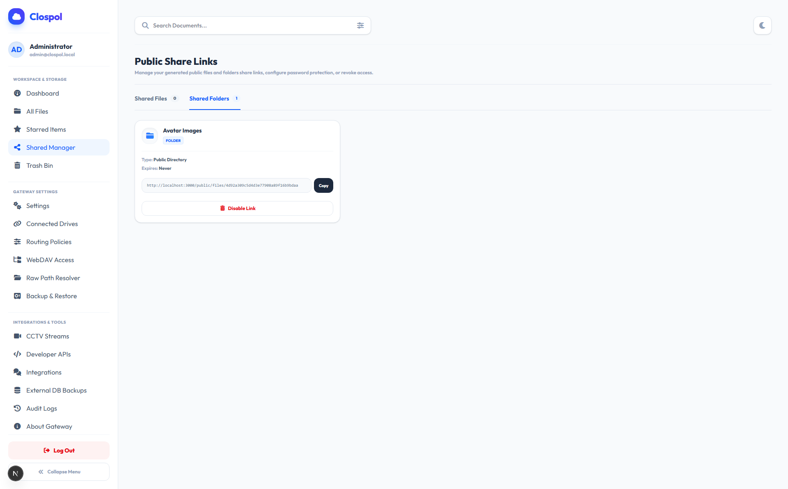

# Clospol


**Clospol** (short for **Cloud Storage Pool**) is a modern, high-performance, and secure **Multi-Cloud Storage Gateway**. It unifies diverse storage environments (Google Drive, Microsoft OneDrive, Dropbox, AWS S3 / compatible object storage like MinIO, Cloudflare R2, Backblaze B2, and physical local paths) into a single workspace, enabling seamless access control, data synchronization, backup automation, media stream management, and automation bots.

---

## 🌟 Key Features

1. **Multi-Cloud Aggregator**
   - Seamlessly connect and mount multiple storage providers: **Google Drive**, **Microsoft OneDrive**, **Dropbox**, **AWS S3 (or S3-compatible like MinIO & Cloudflare R2)**, and **Local Server Directories**.
   - View, organize, upload, download, and manage all your files under a unified, beautiful web dashboard.

2. **WebDAV Gateway Engine**
   - Access your unified cloud folder workspace as a virtual local drive on your operating system via standard WebDAV mounting protocols.

3. **Intelligent Upload Routing & Tiering**
   - Configure automatic data routing policies (e.g., _most available storage_, _round-robin_, or _manual priority accounts_).
   - Set up scheduled or event-driven data tiering rules to transition cold files to cheaper storage.

4. **surveillance CCTV Aggregator**
   - Aggregates and records CCTV streams. Natively schedule video snapshots, record active streams, manage retention days, and view feeds directly in a media gallery.

5. **Automated Database Backups**
   - Automate scheduled dumps of your SQLite, MySQL, or PostgreSQL databases and upload them directly to your connected cloud storage.

6. **Secure Sharing & Public Access Nodes**
   - Generate secure, token-protected sharing links with configurable download limits, password hashing, and expiration timers.

7. **Bot Integrations (WhatsApp & Discord)**
   - Run active WhatsApp and Discord bot daemons natively to trigger storage notifications, status updates, or interactive command interfaces.

---

## 📸 Preview & Screenshots

Here are some previews of the Clospol Storage Gateway interface:

|                   Dashboard View                    |                  Connected Drives                  |
| :-------------------------------------------------: | :------------------------------------------------: |
|  |  |

|                 CCTV Surveillance Feed                 |                  Secure Shared Links                   |
| :----------------------------------------------------: | :----------------------------------------------------: |
|  |  |

---

## 🛠️ Tech Stack

- **Framework**: [Next.js](https://nextjs.org/) (App Router, Tailwind CSS, TypeScript)
- **Database**: SQLite (via [Drizzle ORM](https://orm.drizzle.team/))
- **Surveillance Processing**: [ffmpeg](https://ffmpeg.org/) (for CCTV stream transcode orchestration)
- **Deployment**: [Docker](https://www.docker.com/)

---

## 📦 Prerequisites

Before installing the project, make sure you have the following installed on your machine:

- **Node.js** (v18.x or v20.x recommended)
- **npm** (v10.x+)
- **ffmpeg** (Required for CCTV snapshot/recording functions)

---

## 🚀 Installation & Local Setup

Follow these steps to set up Clospol Storage Gateway locally on your system:

### 1. Clone the Repository

```bash
git clone https://github.com/aaafarrr/Clospol.git
cd Clospol
```

### 2. Install Dependencies

Install npm modules using the clean install command:

```bash
npm install
```

### 3. Environment Configurations

Create your local environment file by copying the template:

```bash
cp .env.example .env
```

Open `.env` and fill in the necessary configurations:

- `APP_KEY`: Secret string used for encrypting database credentials (generate a 32-byte hex string).
- `JWT_ACCESS_SECRET`: Secret token used for signing authentication cookies.
- OAuth Client Credentials for Google Drive, OneDrive, and Dropbox (configured via settings panel later or preset).

### 4. Database Setup & Push Schema

Synchronize the Drizzle schemas with the local SQLite database:

```bash
npx drizzle-kit push
```

### 5. Launch the Application

Run the Next.js development server:

```bash
npm run dev
```

Open [http://localhost:3000](http://localhost:3000) in your web browser.

---

## 🐳 Docker Deployment

For self-hosted production deployment, it is highly recommended to use **Docker** and **Docker Compose**.

### 1. Build and Run Container

```bash
docker-compose up -d --build
```

This command builds the container context, configures system dependencies (like `ffmpeg`), mounts `./storage` persistently, runs database migrations, and exposes the app on port `3000`.

### 2. Update Configurations

You can set environment variables inside the `docker-compose.yml` file under the `environment` property or run a custom `.env` file mounted directly inside.

---

## 🔒 Security & Best Practices

- Always rotate the `APP_KEY` and `JWT_ACCESS_SECRET` variables when deploying to a public server.
- Ensure the `/storage` directory is kept secure as it contains the SQLite database (`dev.db`), cached CCTV segments, local storage mock mappings, and decrypted session descriptors.
- Deploy Behind a Reverse Proxy (e.g. Nginx, Caddy, or Traefik) to configure SSL/TLS endpoints for WebDAV.

---

## 💝 Support the Developer

If you find Clospol Storage Gateway useful, please consider supporting my development work:

- **SociaBuzz**: [Support via SociaBuzz](https://sociabuzz.com/aaafarrr)
